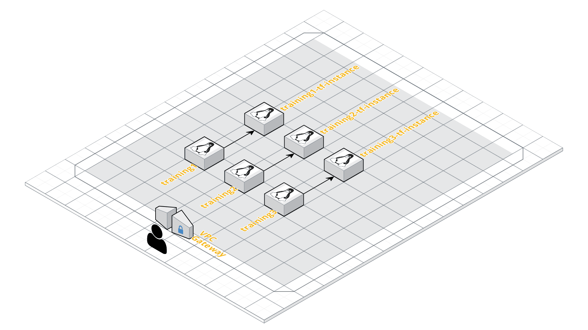

# Background 
This is the sister repo of https://github.com/RoundTower-io/terraform_training_environment.  It sets up the environment 
for this repository's use.  

The above repository creates a series of ec2 instances.  There is one instance per student.  The students are then 
invited to login to their personalized instance.

# How To Use This Repository
This repository demonstrates how to use terraform to build ec2 instances.  The student will clone this repository onto
their local directory in their ec2 instance. Then they will invoke terraform to create another instance. 

# Diagram

