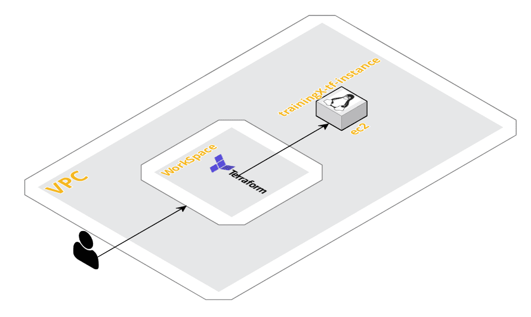

# How To Use This Repository
This repository demonstrates how to use terraform to build ec2 instances.  The student will clone this repository onto
their local directory in their WorkSpace. Then they will invoke terraform to create the ec2 instance. 

# Diagram
The diagram below depicts how a student will login to a WorkSpace. Once this repo is cloned from GitHub, the user
then invokes Terraform to build the ec2 instance.

